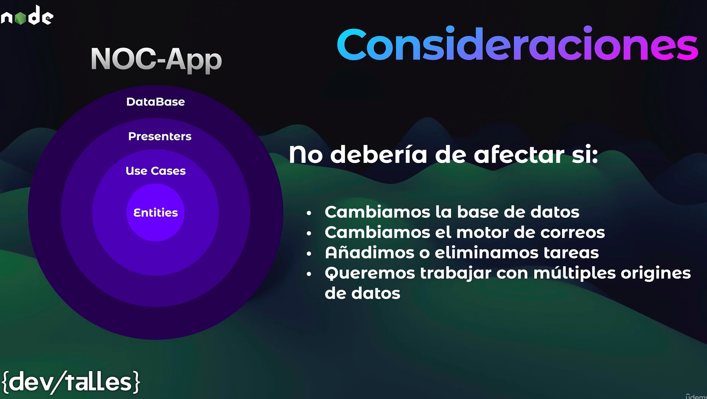

# Sección 08: Aplicación de monitoreo - NOC

- V106 - Introducción a la sección
- V107 - Temas puntuales de la sección
- V108 - Introducción a la aplicación, Clean Architecture + Repository Pattern

- V109 - Inicio de proyecto NOC Tasks
  - [Pasos para usar Node con TS](RECURSOS/Usar_Node_con_TypeScript.pdf)
- V110 - Main - ServerApp
- V111 - CRON Tasks
- V112 - CronService
- V113 - CheckService - UseCase
- V114 - JSON-Server
- V115 - Inyección de dependencias
- V116 - Cierre de sección